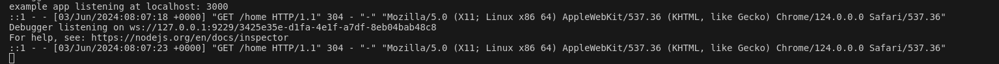
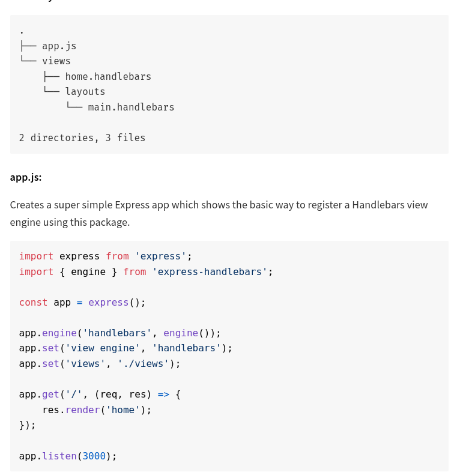
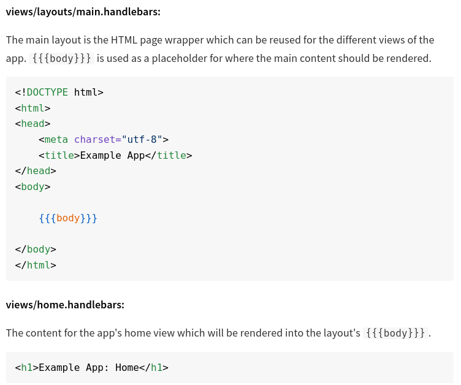

# nodejs_tutorial

# Tutorial

## example 1

- `npm install -g nodemon --save-dev` => [automatically restarting the node application when file changes in the directory are detected.](https://www.npmjs.com/package/nodemon)

- `npm -i morgan --save-dev` => [[TTP request logger middleware for node.js](https://www.npmjs.com/package/morgan)

- `npm install express-handlebars` => install handlebars

